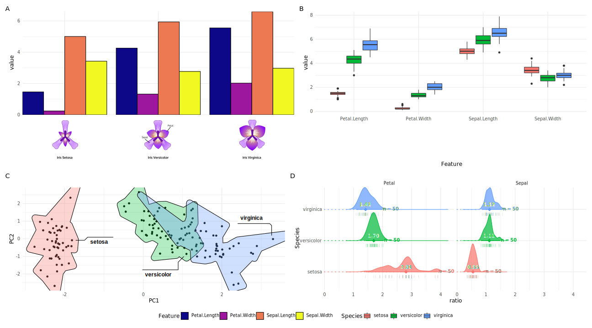
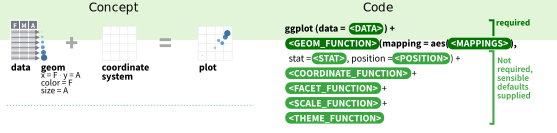
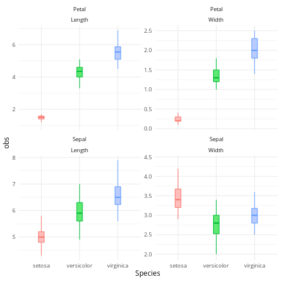
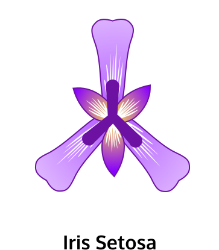
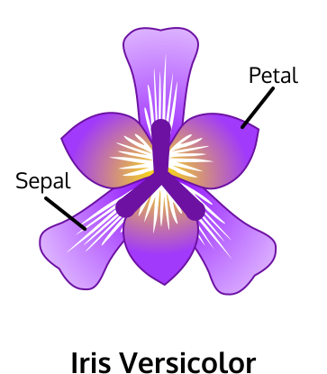

---
output:
  xaringan::moon_reader:
    seal: false
    css: [default,rutgers,metropolis-fonts,custom.css]
    lib_dir: libs
    fig_caption: yes
    fig_height: 8
    fig_width: 10
    nature:
      highlightStyle: github
      highlightLines: true
      highlightSpans: true
      countIncrementalSlides: false
      ratio: '16:9'
---

```{r setup, include=FALSE}
require(knitr)
require(kableExtra)
require(tidyverse)
options(kableExtra.latex.load_packages = FALSE)
options(knitr.table.format = "html")
knitr::opts_chunk$set(dev = 'svg',fig.retina = 3, warning = FALSE, message = FALSE) # set output device to svg
```

class: center, middle
background-image: url(imgs/LOGO-bigA-3101.jpg),url(imgs/cbi.png),url(imgs/logo_UT3_RVB.png)
background-position: 100% 0%,25% 100%,75% 100%
background-size: 28%,15%,20%

## .center[__Awesome visualisation with `R`__]

### .center[A journey with `ggplot2` and the `tidyverse`]

<hr />

.large[Vincent ROCHER | bigA | 03/02/2022]


---

## `ggplot2` training

```{r,echo=F,warning=F,message=F,fig.align='center',fig.height=6,fig.width=14}
require(ggbump)
data_progression <- tibble(
  Parts = c("Read data","Manipulate Data","Plot data","Customize<br>your plots"),
  Tools = c("readr","dplyr/tidyr","ggplot2","ggplot2<br>extensions")
) %>% mutate(order = 1:dplyr::n(),rank = rep(1,dplyr::n()))

data_begin_end <- tibble(
  x=c(0.55,4.55),y=c(1,1),label = c("Data","Descriptive<br>statistics")
)

my_color <- "#2980b9"
p0.training <- data_progression %>% ggplot(aes(order,rank,label = order)) + geom_bump(smooth = 15, size = 2, alpha = 1,col=my_color) + geom_point(col=my_color,alpha=1,size=10) +
  geom_text(col="white", fontface = "bold",size=6) +
  coord_cartesian(clip = 'off') +
  ggtext::geom_richtext(aes(label = Tools),vjust=-1,color=my_color,size=5) +
  ggtext::geom_richtext(data=data_begin_end,aes(x=x,y=y,label = label),fontface = "bold",inherit.aes = F,size=5,fill = NA, label.color = NA,) +
  theme(
        legend.position = "none",
        panel.grid = element_blank(),
        plot.title = element_text(hjust = .5, color = "white"),
        plot.caption = element_text(hjust = 1, color = "white", size = 8),
        plot.subtitle = element_text(hjust = .5, color = "white", size = 10),
        axis.line = element_blank(),
        axis.ticks = element_blank(),
        axis.text.y = element_blank(),
        axis.title = element_blank(),
        axis.text.x = ggtext::element_markdown(face = 2, color = "black",size = 14),
        panel.background = element_rect(fill = "white"),
        plot.background = element_rect(fill = "white")) +
  scale_x_continuous(breaks = data_progression$order %>% unique() %>% sort(),
                     labels = data_progression %>% distinct(order, Parts) %>% arrange(order) %>% pull(Parts))

p1.training <- filter(data_progression,order==1) %>% ggplot(aes(order,rank,label = order)) +
  geom_bump(data= data_progression,smooth = 15, size = 2,col=my_color,alpha=0.4) +
  geom_point(col=my_color,alpha=1,size=10) +
  geom_text(col="white", fontface = "bold",size=6,alpha=1) +
  ggtext::geom_richtext(data=data_begin_end,aes(x=x,y=y,label = label),fontface = "bold",inherit.aes = F,size=5,fill = NA, label.color = NA,) +
  coord_cartesian(clip = 'off') +
  ggtext::geom_richtext(aes(label = Tools),vjust=-1,color=my_color,size=5,alpha=1) +
  
  theme(
        legend.position = "none",
        panel.grid = element_blank(),
        plot.title = element_text(hjust = .5, color = "white"),
        plot.caption = element_text(hjust = 1, color = "white", size = 8),
        plot.subtitle = element_text(hjust = .5, color = "white", size = 10),
        axis.line = element_blank(),
        axis.ticks = element_blank(),
        axis.text.y = element_blank(),
        axis.title = element_blank(),
        axis.text.x = ggtext::element_markdown(face = 2, color = "black",size = 14),
        panel.background = element_rect(fill = "white"),
        plot.background = element_rect(fill = "white")) +
  scale_x_continuous(breaks = data_progression$order %>% unique() %>% sort(),
                     labels = data_progression %>% distinct(order, Parts) %>% arrange(order) %>% pull(Parts))
p2.training <- filter(data_progression,order<=2) %>% ggplot(aes(order,rank,label = order)) +
  geom_bump(data= data_progression,smooth = 15, size = 2,col=my_color,alpha=0.4) +
  geom_bump(smooth = 15, size = 2,col=my_color,alpha=1) +
  geom_point(col=my_color,alpha=1,size=10) +
  geom_text(col="white", fontface = "bold",size=6,alpha=1) +
  ggtext::geom_richtext(data=data_begin_end,aes(x=x,y=y,label = label),fontface = "bold",inherit.aes = F,size=5,fill = NA, label.color = NA,) +
  coord_cartesian(clip = 'off') +
  ggtext::geom_richtext(aes(label = Tools),vjust=-1,color=my_color,size=5,alpha=1) +
  
  theme(
        legend.position = "none",
        panel.grid = element_blank(),
        plot.title = element_text(hjust = .5, color = "white"),
        plot.caption = element_text(hjust = 1, color = "white", size = 8),
        plot.subtitle = element_text(hjust = .5, color = "white", size = 10),
        axis.line = element_blank(),
        axis.ticks = element_blank(),
        axis.text.y = element_blank(),
        axis.title = element_blank(),
        axis.text.x = ggtext::element_markdown(face = 2, color = "black",size = 14),
        panel.background = element_rect(fill = "white"),
        plot.background = element_rect(fill = "white")) +
  scale_x_continuous(breaks = data_progression$order %>% unique() %>% sort(),
                     labels = data_progression %>% distinct(order, Parts) %>% arrange(order) %>% pull(Parts))

p3.training <- filter(data_progression,order<=3) %>% ggplot(aes(order,rank,label = order)) +
  geom_bump(data= data_progression,smooth = 15, size = 2,col=my_color,alpha=0.4) +
  geom_bump(smooth = 15, size = 2,col=my_color,alpha=1) +
  geom_point(col=my_color,alpha=1,size=10) +
  geom_text(col="white", fontface = "bold",size=6,alpha=1) +
  ggtext::geom_richtext(data=data_begin_end,aes(x=x,y=y,label = label),fontface = "bold",inherit.aes = F,size=5,fill = NA, label.color = NA,) +
  coord_cartesian(clip = 'off') +
  ggtext::geom_richtext(aes(label = Tools),vjust=-1,color=my_color,size=5,alpha=1) +
  
  theme(
        legend.position = "none",
        panel.grid = element_blank(),
        plot.title = element_text(hjust = .5, color = "white"),
        plot.caption = element_text(hjust = 1, color = "white", size = 8),
        plot.subtitle = element_text(hjust = .5, color = "white", size = 10),
        axis.line = element_blank(),
        axis.ticks = element_blank(),
        axis.text.y = element_blank(),
        axis.title = element_blank(),
        axis.text.x = ggtext::element_markdown(face = 2, color = "black",size = 14),
        panel.background = element_rect(fill = "white"),
        plot.background = element_rect(fill = "white")) +
  scale_x_continuous(breaks = data_progression$order %>% unique() %>% sort(),
                     labels = data_progression %>% distinct(order, Parts) %>% arrange(order) %>% pull(Parts))

p4.training <- filter(data_progression,order<=4) %>% ggplot(aes(order,rank,label = order)) +
  geom_bump(data= data_progression,smooth = 15, size = 2,col=my_color,alpha=0.4) +
  geom_bump(smooth = 15, size = 2,col=my_color,alpha=1) +
  geom_point(col=my_color,alpha=1,size=10) +
  geom_text(col="white", fontface = "bold",size=6,alpha=1) +
  ggtext::geom_richtext(data=data_begin_end,aes(x=x,y=y,label = label),fontface = "bold",inherit.aes = F,size=5,fill = NA, label.color = NA,) +
  coord_cartesian(clip = 'off') +
  ggtext::geom_richtext(aes(label = Tools),vjust=-1,color=my_color,size=5,alpha=1) +
  
  theme(
        legend.position = "none",
        panel.grid = element_blank(),
        plot.title = element_text(hjust = .5, color = "white"),
        plot.caption = element_text(hjust = 1, color = "white", size = 8),
        plot.subtitle = element_text(hjust = .5, color = "white", size = 10),
        axis.line = element_blank(),
        axis.ticks = element_blank(),
        axis.text.y = element_blank(),
        axis.title = element_blank(),
        axis.text.x = ggtext::element_markdown(face = 2, color = "black",size = 14),
        panel.background = element_rect(fill = "white"),
        plot.background = element_rect(fill = "white")) +
  scale_x_continuous(breaks = data_progression$order %>% unique() %>% sort(),
                     labels = data_progression %>% distinct(order, Parts) %>% arrange(order) %>% pull(Parts))
print(p0.training)
```

* Slides : https://rochevin.github.io/formation_ggplot2
* Download slides and data: https://github.com/rochevin/formation_ggplot2/archive/refs/heads/main.zip
* Compagnon wiki: https://github.com/rochevin/formation_ggplot2/wiki

---

## Why `ggplot2` instead of base plot ?


* Provide helpful commands to create complex, "almost" publication ready plots.
* Minimal changes from the data are needed to change from a barplot to a scatterplot.
* Include summary statistics (mean / median / linear regression).
* Plots are heavily customizable (even if the plot is generated by someone else).
* Heavily documented and used.
* [A lot of extensions](https://github.com/erikgahner/awesome-ggplot2).


```{r out.width = "100%", fig.align = "center",echo=F}
knitr::include_graphics("imgs/ggplot2_gallery.svg")
```
.right[
<sub>[Thomas Mock (2022). Tidy Tuesday: A weekly data project aimed at the R ecosystem.](https://github.com/rfordatascience/tidytuesday)</sub>
]

---

## Why `ggplot2` instead of base plot ?

.center[
```{r out.width = '90%',echo=F}

```
]

---
class: center, middle
background-image: url(imgs/Tidyverse.png)
background-position: 0% 100%
background-size: 60%

.pull-right[

## R packages for data science

The tidyverse is an opinionated collection of R packages designed for data science. All packages share an underlying design philosophy, grammar, and data structures.

Install the complete tidyverse with:

```r
install.packages("tidyverse")
```

Look at the cheatsheets: https://www.rstudio.com/resources/cheatsheets/

]

---

## Tidyverse


```{r eval=F}
require(tidyverse)
```

```
── Attaching packages ─────────────────────────────────────────── tidyverse 1.3.1 ──
✔ ggplot2 3.3.6     ✔ purrr   0.3.4
✔ tibble  3.1.7     ✔ dplyr   1.0.9
✔ tidyr   1.2.0     ✔ stringr 1.4.0
✔ readr   2.1.2     ✔ forcats 0.5.1
── Conflicts ────────────────────────────────────────────── tidyverse_conflicts() ──
✖ dplyr::filter() masks stats::filter()
✖ dplyr::lag()    masks stats::lag()
```

```{r,echo=F}
data_progression %>% dplyr::select(Parts,Tools) %>%
  mutate_all(function(x){str_replace(x,"<br>"," ")}) %>% 
  kable() 
```


---

### Tidy data

> __Tidying:__ structuring datasets to facilitate analysis.

A tidy dataset :

```{r out.width = "100%", fig.align = "center",echo=F}
knitr::include_graphics("imgs/tidy-1.png")
```

---

### Why tidying a dataset ?

```{r define, echo=F, message=FALSE, warning=FALSE}
treatments <- 
    data.frame(
        treatment_a = sample(10:25,size = 3,replace = T),
        treatment_b = sample(10:25,size = 3,replace = T),
        treatment_c = sample(10:25,size = 3,replace = T)
    )
rownames(treatments) <- c("John Smith","Jane Doe","Mary Johnson")
```


```{r show1,results='asis',echo=F}
treatments %>% kable(caption = "Typical presentation dataset") %>%
  kable_styling(bootstrap_options = c("striped", "hover"))
```


```{r boxplot1, echo=T, fig.height=3.5, fig.width=8,fig.align='center'}
boxplot(treatments)
```

---

### Why tidying a dataset ?

```{r,echo=T}
treatments.2 <- t(treatments)
```


```{r, echo=F,results='asis'}
kable(treatments.2,caption = "The same data but structured differently") %>%
  kable_styling(bootstrap_options = c("striped", "hover"))
```


```{r boxplot2, echo=T, fig.height=3.5, fig.width=8,fig.align='center'}

boxplot(treatments.2)
```


---

### Why tidying a dataset ?

```{r}
treatments.3 <- tibble::rownames_to_column(treatments,var = "person")
treatments.3 <- tidyr::pivot_longer(treatments.3,-person,names_to = "treatment",values_to = "result")
```


```{r echo=FALSE, message=FALSE, warning=FALSE,results='asis'}
treatments.3 %>% mutate(treatment = cell_spec(treatment, align = "c",background =factor(treatment,unique(treatments.3$treatment),RColorBrewer::brewer.pal(length(unique(treatments.3$treatment)), "Spectral")))) %>% mutate(person = cell_spec(person, align = "c",background =factor(person,unique(treatments.3$person),RColorBrewer::brewer.pal(length(unique(treatments.3$treatment)), "Set1")))) %>% 
    mutate(result = cell_spec(result, align = "c",background ="black",color = "white")) %>% kable(caption = "An exemple of a tidy dataset",escape=F) %>%
  kable_styling(bootstrap_options = c("striped", "hover"))
```


---

### Why tidying a dataset ?

```{r boxplot3, echo=TRUE, fig.height=5, fig.width=8, message=FALSE, warning=FALSE,fig.align='center'}
boxplot(result~treatment,data=treatments.3)
```

---

### Why tidying a dataset ?

```{r boxplot4, echo=TRUE, fig.height=5, fig.width=8, message=FALSE, warning=FALSE,fig.align='center'}
boxplot(result~person,data=treatments.3)
```

---

### Why tidying a dataset ?

```{r boxplot5, echo=TRUE, fig.height=5, fig.width=8, message=FALSE, warning=FALSE,fig.align='center'}
boxplot(result~person+treatment,data=treatments.3)
```

---

## Read a dataset 

```{r,echo=F,warning=F,message=F,fig.align='center',fig.height=6,fig.width=14}
p1.training
```

---

## Read a dataset with base `R`

```{r}
read.table(file = "iris.tsv",sep="\t",header = T)
```

---

## Read a dataset with base `R`

* Return a `data.frame` object.
* `read.csv`, `read.csv2`, `read.delim` can also be used.
* Cannot read `.xsl` files (we have to use another package).

---

## Read a dataset with `readr`

```{r}
read_tsv(file = "iris.tsv")
```

---

## Read a dataset with `readr`

* Return a `tibble` object.
* `read_csv`, `read_csv2`, `read_table` can also be used.
* `.xsl` files are managed by `readxl`, an other tidyverse package (not loaded by default). 

---

###Tibbles: `tibble::tibble()`

__Pros: __

* Cells can contain list and data.frame.
* It never changes an input’s type (i.e., no more `stringsAsFactors = FALSE`!).
* Can use not valid R variable names (`:)`) as column names.
* Refined print method that shows only the first 10 rows.


__Cons: __

* It never uses `row.names()`.
    * use `tibble::rownames_to_column()`.
---

## Data manipulation with `dplyr` and `tidyr`

```{r,echo=F,warning=F,message=F,fig.align='center',fig.height=6,fig.width=14}
p2.training
```

---

## Data manipulation with `dplyr` and `tidyr`

#### dplyr is a grammar of data manipulation, providing a consistent set of verbs that help you solve the most common data manipulation challenges:

* `mutate()` adds new variables that are functions of existing variables
* `select()` picks variables based on their names.
* `filter()` picks cases based on their values.
* `summarise()` reduces multiple values down to a single summary.
* `arrange()` changes the ordering of the rows.
* `group_by()` perform any operation "by group".

#### Some examples :

.pull-left[
```{r}
summarise(iris,mean(Petal.Width))
```
]
.pull-right[
```{r}
summarise(group_by(iris,Species),mean(Petal.Width))
```
]


---

##Pipes

__The pipe %>%:__

* Come from the \textbf{magrittr} package by Stefan Milton Bache.
* Automatically loaded in tidyverse.
* Equivalent to `|` in `bash`

```{bash echo=TRUE}
cat iris.tsv | cut -f5 | sed 's/^./\U&/' | head
```

```{r echo=TRUE, message=FALSE, warning=FALSE}
read_tsv("iris.tsv",col_names = F) %>% pull(5) %>% str_to_title() %>% head
```

---

##Pipes vs no pipes : without pipe

```{r,echo=FALSE}
set.seed(123)
```

```{r histo1,echo=T, fig.height=3, fig.width=8,fig.align='center'}
ex.dat <- rnorm(n = 1000,mean = 5,sd=1)
sub.dat <- sample(ex.dat,size = 100,replace=F)
hist(sub.dat)
```

---

##Pipes vs no pipes : without pipe

```{r,echo=FALSE}
set.seed(123)
```

```{r histo2,echo=T, fig.height=3, fig.width=8,fig.align='center'}
hist(sample(rnorm(n = 1000,mean = 5,sd=1),size = 100,replace=F))
```

---

##Pipes vs no pipes : with pipe

```{r,echo=FALSE}
set.seed(123)
```

```{r histo3,echo=T, fig.height=3, fig.width=8,fig.align='center'}
rnorm(n = 1000,mean = 5,sd=1) %>%
    sample(size = 100,replace=F) %>%
    hist()
```


---
## Prepare `iris` dataset for `ggplot2`

###iris dataset
> The famous (Fisher’s or Anderson’s) iris data set gives the measurements in centimeters of the variables sepal length and width and petal length and width, respectively, for 50 flowers from each of 3 species of iris. The species are Iris setosa, versicolor, and virginica. (from ?iris)


```{r,results='asis',echo=F}

iris %>% head() %>% kable(caption="iris dataset") %>%
  kable_styling(bootstrap_options = c("striped", "hover"))

```


---

.left-column[
## `r icons::fontawesome("laptop-code", style = "solid")` Your turn
] 
.right-column[

1. Load the iris dataset from the `iris.tsv` file using `readr::read_tsv()`.
2. Create a new column called `Individual`, labelling each individual by a number with `dplyr::mutate()` and `dplyr::n()`.
3. Manipulate the table to lengthens data with `tidyr::pivot_longer()`, increasing the number of rows and decreasing the number of columns.
4. Use `tidyr::separate` to split the `Feature` column into two new columns: `Part` and `Metric`.
5. __Bonus__: try to do some basic statistics with `dplyr::group_by()` and `dplyr::summarise()`.
6. __Bonus__: Add descriptive metadata from `iris_metadata.tsv` with `dplyr::left_join()`.


]

.pull-left[
#### __Need some help ?__

* Try to look at the cheatsheets: https://www.rstudio.com/resources/cheatsheets/. 
* Take a look at the [wiki](https://github.com/rochevin/formation_ggplot2/wiki/Data-manipulation-with-Tidyverse)

]
.pull-right[

```{r ggplot18,echo=F, fig.height=2, fig.width=2, message=FALSE, warning=FALSE,dev.args = list(bg = "transparent"),fig.align="center",dpi=150,fig.retina=3}
minutes <- data_frame(y = 0:60,x=1)

hours <- filter(minutes, y %% 5 == 0)


my.time <- 10
my.time.str <- glue::glue("{my.time} minutes")


p_timer <- ggplot(minutes,aes(x = x, y = y)) +
  geom_bar(data=filter(minutes,y==my.time),stat="identity", width=1, col="black",fill="#bdc3c7",alpha=0.7) +
  geom_point(data = minutes,aes(x=1.5)) +
  geom_point(data = hours, aes(x = 1.5, y = y,col=y),
             size = 4, show.legend = FALSE) +
  geom_text(aes(y = 30, x = 0.5, label = my.time.str), vjust = 1, size = 4,col="black") +
  coord_polar("y", start=0) +
  # scale_color_viridis_c() +
  scale_color_gradient2(low = "black",mid="#2ecc71",high="#e74c3c") +
  theme_void() + 
  theme(legend.position="none",panel.background = element_rect(fill = "transparent", colour = NA),  plot.background = element_rect(fill = "transparent", colour = NA))
print(p_timer)
```


]

---
## Prepare `iris` dataset for `ggplot2`


```{r}
iris.tbl <- readr::read_tsv("iris.tsv") %>%
  dplyr::mutate(Individual = 1:dplyr::n()) %>% 
  tidyr::pivot_longer(-Species:-Individual,names_to = "Type",values_to = "obs") %>%
  tidyr::separate(Type,into = c("Part","Metric"),se="\\.")
```

```{r,echo=F}
iris.tbl %>%  dplyr::slice(1:10) %>% kable()
```

---

## Produce awesome plots using `ggplot2`

```{r,echo=F,warning=F,message=F,fig.align='center',fig.height=6,fig.width=14}
p3.training
```


---


### The three key components of every ggplot2

* __data__: the dataset who's need to be plotted.
* __aesthetics__: aesthetics mapping between variables in the data (x,y,visuals properties, ...).
* __geoms__: one or more layers to render each observations.

.center[
```{r out.width = '100%',echo=F}

```

]


---

### The three key components of every ggplot2

.pull-left[


```{r,eval=F}
ggplot(`data = iris.tbl`,
       `aes(x=Part,y=obs)`) 
```


* __data__: `data = iris`.
* __aesthetics__: `aes(x=Part,y=obs)`.

]
.pull-right[

```{r,echo=F,width=4,height=4}
ggplot(data = iris.tbl,aes(x=Part,y=obs)) 
```


]


---

### The three key components of every ggplot2

.pull-left[


```{r,eval=F}
ggplot(`data = iris.tbl`,
       `aes(x=Part,y=obs)`) +
  `geom_boxplot()`
```


* __data__: `data = iris`.
* __aesthetics__: `aes(x=Part,y=obs)`.
* __geoms__: `geom_boxplot()`.

]
.pull-right[

```{r,echo=F,width=4,height=4}
ggplot(data = iris.tbl,aes(x=Part,y=obs)) +
  geom_boxplot()
```


]


---

### The three key components of every ggplot2

.pull-left[


```{r,eval=F}
ggplot(`data = iris.tbl`,
       `aes(x=Part,y=obs,fill=Species)`) +
  `geom_boxplot()`
```


* __data__: `data = iris`.
* __aesthetics__: `aes(x=Part,y=obs,fill=Species)`.
* __geoms__: `geom_boxplot()`.

]
.pull-right[

```{r,echo=F,width=4,height=4}
ggplot(data = iris.tbl,aes(x=Part,y=obs,fill=Species)) +
  geom_boxplot()
```


]


---

### The three key components of every ggplot2

.pull-left[


```{r,eval=F}
ggplot(`data = iris.tbl`,
       `aes(x=Part,y=obs,color=Species)`) +
  `geom_boxplot()`
```


* __data__: `data = iris`.
* __aesthetics__: `aes(x=Part,y=obs,color=Species)`.
* __geoms__: `geom_boxplot()`.

]
.pull-right[

```{r,echo=F,width=4,height=4}
ggplot(data = iris.tbl,aes(x=Part,y=obs,color=Species)) +
  geom_boxplot()
```


]


---

### The three key components of every ggplot2

.pull-left[


```{r,eval=F}
ggplot(`data = iris.tbl`,
       `aes(x=Part,y=obs,color=Species)`) +
  `geom_boxplot()` +
  facet_wrap(~Metric,scales="free_y")
```


* __data__: `data = iris`.
* __aesthetics__: `aes(x=Part,y=obs,color=Species)`.
* __geoms__: `geom_boxplot()`.
* __facet function__: `facet_wrap(~Metric,scales="free_y")`.

__Facetting__: 

* `facet_grid(~variable)` : Display all possibility even if some plots are __empty__.
* `facet_wrap(~variable)` : Display only the plots having actual values.


]
.pull-right[

```{r,echo=F,width=4,height=4}
ggplot(data = iris.tbl,aes(x=Part,y=obs,color=Species)) +
  geom_boxplot() +
  facet_wrap(~Metric,scales="free_y")
```


]


---

### The three key components of every ggplot2


.pull-left[

### Combining multiples `geom_`


```{r,eval=F}
p <- ggplot(`data = iris.tbl`,
       `aes(x=Part,y=obs,color=Species)`) +
  facet_wrap(Part~Metric,scales="free_y")

p <- p +  `geom_boxplot(width=0.15,outlier.shape=NA)`
p <- p +  `geom_violin(alpha=0.2)`
p <- p +  `geom_jitter(width=0.15)`
```


* `geom_boxplot(width=0.15,outlier.shape=NA)`: display data as boxplot, without outliers.
* `geom_violin(alpha=0.2)`: display data density, on mirror (violin).
* `geom_jitter(width=0.15)`: display data as point, using some random variation to `x` (jitter).

]

.pull-right[
```{r out.width = '100%',echo=F}

```

]

---

### Uses of aesthetics within `aes`


.pull-left[

#### aesthetics can be hardcoded


```{r,eval=F}
ggplot(data = iris.tbl,
       aes(x=Part,y=obs)) +
    geom_boxplot(`fill = "grey40"`,
                     `col = "steelblue"`) +
  geom_jitter(`alpha=0.4`)
```

```{r,echo=F,fig.height=3,fig.width=4}
ggplot(data = iris.tbl,
       aes(x=Part,y=obs)) +
    geom_boxplot(fill = "grey40",col = "steelblue") +
  geom_jitter(alpha=0.4)
```

]

--

.pull-right[

#### Or included within `aes`

```{r,eval=F}
ggplot(data = iris.tbl,
       aes(x=Part,y=obs,`col=Species`,`shape=Metric`)) +
    geom_boxplot() +
  geom_jitter(alpha=0.4)
```

```{r,echo=F,fig.height=3,fig.width=4}
ggplot(data = iris.tbl,
       aes(x=Part,y=obs,col=Species,shape=Metric)) +
    geom_boxplot(outlier.shape = NA) +
  geom_jitter(alpha=0.4) 
```


]


---
### Uses of aesthetics within `aes`


```{r,eval=F}
ggplot(data = iris.tbl,
       aes(x=Part,y=obs,`col=Species`,`shape=Metric`)) +
    geom_boxplot() +
  geom_jitter(alpha=0.4)
```

```{r,echo=F,fig.height=4,fig.width=8,fig.align='center'}
ggplot(data = iris.tbl,
       aes(x=Part,y=obs,col=Species,shape=Metric)) +
    geom_boxplot(outlier.shape = NA) +
  geom_jitter(alpha=0.4) + theme(legend.position ="bottom")
```


---
### Uses of aesthetics within `aes`

`aes()` can be called within `ggplot` function or within each `geom_*`.

```{r,eval=F}
ggplot(data = iris.tbl,
       aes(x=Part,y=obs)) +
    geom_boxplot() +
  geom_jitter(aes(`col=Species`,`shape=Metric`),alpha=0.4)
```

```{r,echo=F,fig.height=4,fig.width=8,fig.align='center'}
ggplot(data = iris.tbl,
       aes(x=Part,y=obs)) +
    geom_boxplot(outlier.shape = NA) +
  geom_jitter(aes(col=Species,shape=Metric),alpha=0.4) + theme(legend.position ="bottom")
```


---
### Uses of aesthetics within `aes`


```{r,eval=F}
p_boxplot <- ggplot(data = iris.tbl,
       aes(x=Part,y=obs)) +
    geom_boxplot() +
  geom_jitter(aes(`col=Species`,`shape=Metric`),alpha=0.4) +
  `facet_wrap(~Metric)`
p_boxplot
```

```{r,echo=F,fig.height=3.5,fig.width=8,fig.align='center'}
p_boxplot <- ggplot(data = iris.tbl,
       aes(x=Part,y=obs)) +
    geom_boxplot(outlier.shape = NA) +
  geom_jitter(aes(col=Species,shape=Metric),alpha=0.4) + theme(legend.position ="bottom") +
  facet_wrap(~Metric)
p_boxplot
```

Strength of `ggplot2`: Combining various aesthetics allow to display __multiples variable in one plot easily.__

---

### How to zoom/set axis with `ggplot2`

#### __Use `coord_cartesian` to zoom, not `xlim`, `ylim`, or `scale_*`__

.pull-left[
```{r}
p_boxplot_1 <- p_boxplot + ylim(c(2,4))
```
]

.pull-right[
```{r}
p_boxplot_2 <- p_boxplot +
  coord_cartesian(ylim=c(2,4))
```
]

```{r,fig.height=6,fig.width=16,fig.align='center',echo=F}
require(patchwork)
(p_boxplot + ggtitle("base plot")+ geom_hline(yintercept = c(2,4),linetype="dashed")) + (p_boxplot_1  + ggtitle("with ylim")) + (p_boxplot_2 + ggtitle("with coord_cartesian"))
```


---

### Graphical options

```{r ggplot13,echo=TRUE, fig.height=5, fig.width=14, message=FALSE, warning=FALSE}
p <- iris.tbl  %>% 
  ggplot(aes(x=Species,y=obs,color=Species,fill = after_scale(colorspace::lighten(color, .5)))) +
  geom_boxplot(width=0.15,outlier.shape=NA) +
  geom_violin(alpha=0.2) +
  geom_jitter(width=0.15)+
  facet_wrap(Part~Metric,scales="free_y",nrow=1) +
    scale_color_brewer(palette="Set1") #A new palette
print(p)
```


---

```{r ggplot14,echo=F, fig.height=8, fig.width=14, message=FALSE, warning=FALSE}
require(patchwork)
p <- iris.tbl  %>% 
  ggplot(aes(x=Species,y=obs,color=Species,fill = after_scale(colorspace::lighten(color, .5)))) +
  geom_boxplot(width=0.15,outlier.shape=NA) +
  geom_violin(alpha=0.2) +
  geom_jitter(width=0.15)+
  facet_wrap(Part~Metric,scales="free_y",nrow=1) + theme(legend.position = "right")
p11 <- p + scale_color_brewer(palette="Set1") + ggtitle("scale_color_brewer(palette='Set1')")
p12 <- p + scale_color_viridis_d() + ggtitle("scale_color_viridis_d()")
p13 <- p + scale_color_manual(values = c('red','blue','green')) + ggtitle("scale_color_manual(values = c('red','blue','green'))")
p11/p12/p13
```


---

### Various `geom_*` for various aesthetic.

```{r ggplot11,echo=F, fig.height=10, fig.width=22, message=FALSE, warning=FALSE}

p1 <- iris %>%# Data
    ggplot(aes(x=Species,y=Petal.Length)) +# aesthetics
    geom_violin(col = "#3c6382") + geom_boxplot(col = "#3c6382",width=0.1) + geom_jitter(col = "#3c6382") +  theme_minimal() + ggtitle("discrete x, continous y") + theme(plot.title = element_text(size = 20, face = "bold"))
p2 <- iris %>%# Data
    ggplot(aes(x=Petal.Width,y=Petal.Length,label = Species)) +# aesthetics
    geom_point(col = "#3c6382") +# Layer: points
    geom_smooth(method = "loess",col="#3c6382") + theme_minimal() + ggtitle("continous x, continous y")  + theme(plot.title = element_text(size = 20, face = "bold"))

p3 <- iris %>% select(Petal.Width,Species) %>% group_by(Species) %>% mutate(pos = 1:n()) %>% group_by(pos) %>% summarise(mean = mean(Petal.Width), sd = sd(Petal.Width)) %>% ggplot(aes(x=pos,y=mean)) + geom_line(col = "#3c6382") + geom_ribbon(aes(ymin = mean - sd, ymax = mean + sd),fill = "#3c6382",alpha=0.3) + theme_minimal() + ggtitle("continous x, continous y")  + theme(plot.title = element_text(size = 20, face = "bold"))

p4 <- iris %>% ggplot(aes(Petal.Length)) + geom_histogram(aes(y=..density..),fill = "#3c6382") + geom_density(aes(y=..density..))  + ggtitle("one variable continous")  + theme_minimal()+ theme(plot.title = element_text(size = 20, face = "bold"))

p5 <- iris %>%
    gather(key = "Type",value = "obs",-Species) %>% separate(Type,into = c("Type_1","Type_2"),se="\\.") %>% ggplot(aes(x=Type_1,y = obs)) + geom_bar(stat = "summary", fun.y = "mean",fill= "#3c6382",width=0.5) + facet_wrap(~Type_2,scale="free_y") + theme_minimal()  + ggtitle("discrete x, continous y") + theme(plot.title = element_text(size = 20, face = "bold"))

p6 <- iris %>% gather(key = "Type",value = "obs",-Species) %>% group_by(Species,Type) %>% mutate(individuals = 1:n()) %>% ggplot(aes(y=individuals,x=Type,fill=obs))+ geom_tile() + theme_minimal()  + ggtitle("discrete x, discrete y") + theme(plot.title = element_text(size = 20, face = "bold"),legend.position = "none") + scale_fill_gradient2(low = "#f5f6fa",high = "#3c6382")

cowplot::plot_grid(p1,p5,p6,p2,p3,p4)

```


---

##Themes

```{r,echo=F}
p <- iris %>%
    ggplot(aes(x=Petal.Width,y=Petal.Length)) +
    geom_point(aes(col=Species,size = Sepal.Length))
```


.pull-left[
```{r, fig.height=8, fig.width=8, message=FALSE, warning=FALSE}
p
```
]


.pull-right[
```{r, fig.height=8, fig.width=8, message=FALSE, warning=FALSE}
p + theme_classic()
```
]

---

##Themes

```{r ggplot15,echo=F, fig.height=10, fig.width=22, message=FALSE, warning=FALSE}
p <- iris %>%# Data
    ggplot(aes(x=Petal.Width,y=Petal.Length)) +# aesthetics
    geom_point(aes(col=Species,size = Sepal.Length))#A new palette
p1 <- p + theme_grey(base_size = 22) + ggtitle("theme_grey") + theme(legend.position = "none") 

p2 <- p + theme_gray(base_size = 22)+ ggtitle("theme_gray") + theme(legend.position = "none") 

p3 <- p + theme_bw(base_size = 22)+ ggtitle("theme_bw") + theme(legend.position = "none") 

p4 <- p + theme_linedraw(base_size = 22)+ ggtitle("theme_linedraw") + theme(legend.position = "none") 

p5 <- p + theme_light(base_size = 22)+ ggtitle("theme_light") + theme(legend.position = "none") 

p6 <- p + theme_dark(base_size = 22)+ ggtitle("theme_dark") + theme(legend.position = "none") 

p7 <- p + theme_minimal(base_size = 22)+ ggtitle("theme_minimal") + theme(legend.position = "none") 

p8 <- p + theme_classic(base_size = 22)+ ggtitle("theme_classic") + theme(legend.position = "none") 

p9 <- p + theme_void(base_size = 22)+ ggtitle("theme_void") + theme(legend.position = "none") 

p10 <- p + theme_test(base_size = 22)+ ggtitle("theme_test") + theme(legend.position = "none") 

cowplot::plot_grid(p1,p2,p3,p4,p5,p6,p7,p8,p9,p10)

```

---

##Themes

```{r ggplot16,echo=F, fig.height=10, fig.width=22, message=FALSE, warning=FALSE}
p <- iris %>%
    gather(key = "Type",value = "obs",-Species) %>% separate(Type,into = c("Type_1","Type_2"),se="\\.") %>% ggplot(aes(x=Species,y = obs,fill=Species)) + geom_boxplot(width=0.5) + facet_grid(Type_2~Type_1,scales = "free")
p1 <- p + theme_grey(base_size = 22) + ggtitle("theme_grey") + theme(legend.position = "none") 

p2 <- p + theme_gray(base_size = 22)+ ggtitle("theme_gray") + theme(legend.position = "none") 

p3 <- p + theme_bw(base_size = 22)+ ggtitle("theme_bw") + theme(legend.position = "none") 

p4 <- p + theme_linedraw(base_size = 22)+ ggtitle("theme_linedraw") + theme(legend.position = "none") 

p5 <- p + theme_light(base_size = 22)+ ggtitle("theme_light") + theme(legend.position = "none") 

p6 <- p + theme_dark(base_size = 22)+ ggtitle("theme_dark") + theme(legend.position = "none") 

p7 <- p + theme_minimal(base_size = 22)+ ggtitle("theme_minimal") + theme(legend.position = "none") 

p8 <- p + theme_classic(base_size = 22)+ ggtitle("theme_classic") + theme(legend.position = "none") 

p9 <- p + theme_void(base_size = 22)+ ggtitle("theme_void") + theme(legend.position = "none") 

p10 <- p + theme_test(base_size = 22)+ ggtitle("theme_test") + theme(legend.position = "none") 

cowplot::plot_grid(p1,p2,p3,p4,p5,p6,p7,p8,p9,p10)

```


---

## A custom Theme

```{r ggplot17,echo=F, fig.height=10, fig.width=22, message=FALSE, warning=FALSE}
p <- iris %>%
    gather(key = "Type",value = "obs",-Species) %>% separate(Type,into = c("Type_1","Type_2"),se="\\.") %>% ggplot(aes(x=Species,y = obs,fill=Species)) + geom_boxplot(width=0.5) + facet_grid(Type_2~Type_1,scales = "free") + ggtitle("Iris dataset")

p1 <-iris %>%
    gather(key = "Type",value = "obs",-Species) %>% separate(Type,into = c("Type_1","Type_2"),se="\\.") %>% ggplot(aes(x=Species,y = obs,fill=Species)) + geom_boxplot(width=0.5,col="#dfe6e9") + facet_grid(Type_2~Type_1,scales = "free") + ggtitle("Iris dataset") + theme_minimal(base_size=18) + theme(text = element_text(family="Helvetica",face="bold"),legend.key = element_rect(fill = "#f1f2f6", colour = "#3c6382",linetype="dotted"), 

plot.title = element_text(size = rel(1.5),colour = "#2f3542",hjust = 0.5), 
strip.background = element_rect(fill = "#636e72", colour = "#2d3436"), 
panel.background = element_rect(fill = "#2d3436", colour = "#2d3436"), 
strip.text = element_text(colour = "#dfe6e9"),
panel.border = element_blank(), 
panel.grid.major = element_line(colour = "#f5f6fa",linetype = "dashed",size = 0.3), 
panel.grid.minor = element_line(colour = "#f5f6fa", size = 0.25,linetype = "dotted"),
legend.position = "bottom",legend.key.size =  unit(0.3, "in"),legend.text = element_text(size=rel(1.2)),legend.title = element_text(size=rel(1.2))) + ggsci::scale_fill_tron() 

cowplot::plot_grid(p,p1)

```


---

## Get, set, and modify the active theme with `theme_set()` and `theme_update()`

.pull-left[

```{r theme_display,fig.height=3,fig.width=4}
p
```

]
.pull-right[
```{r ,eval=F}
theme_set(theme_minimal(base_size=6))
theme_update(
  strip.background = element_rect(fill = "#636e72", colour = "#2d3436"), 
  panel.background = element_rect(fill = "#2d3436", colour = "#2d3436"), 
  strip.text = element_text(colour = "#dfe6e9")
)
p
```


```{r theme_display2,fig.height=3,fig.width=4,echo=F}
p + theme_minimal(base_size=6) + theme(
  strip.background = element_rect(fill = "#636e72", colour = "#2d3436"), 
  panel.background = element_rect(fill = "#2d3436", colour = "#2d3436"), 
  strip.text = element_text(colour = "#dfe6e9")
)
```

]

---

## Save your plot
```{r}

```

.pull-left[
### Using `pdf()`, `png()`, `svg()`, ...
```{r,eval=F}
pdf("myplot.pdf",height=4,width=4)
print(p)
dev.off()
```
]


.pull-right[
### Using `ggplot2::ggsave`
```{r,eval=F}
ggplot2::ggsave("myplot.pdf",p,height=4,width=4)
```
]

* `height` and `width` are in inches for `pdf()`, but can be changed with `ggsave(units="px")`.
* `ggsave` will figure what format you want based on the file extension (".pdf").
* `dpi` parameter allow to change the plot resolution: "retina" (320), "print" (300), or "screen" (72).
---

.left-column[
## `r icons::fontawesome("laptop-code", style = "solid")` Your turn
] 
.right-column[

1. Try a various combination of `geom_*` to represent the `iris` dataset:
  * discrete, continous.
  * discrete, discrete.
  * continous, continous.
  * continous.
2. Customize your plot using a different color palettes and themes. 
3. __Bonus__: Compute descriptive statistics using `dplyr::summarise()` or `ggplot2::stat_summary()`.


]

.pull-left[
#### __Need some help ?__

* Try to look at the ggplot2 cheatsheets: https://raw.githubusercontent.com/rstudio/cheatsheets/main/data-visualization.pdf. 
* Take a look at the [wiki](https://github.com/rochevin/formation_ggplot2/wiki/Produce-awesome-plots-using-ggplot2)

]
.pull-right[

```{r ggplot19,echo=F, fig.height=2.5, fig.width=2.5, message=FALSE, warning=FALSE,dev.args = list(bg = "transparent"),fig.align="center",dpi=150,fig.retina=3}
minutes <- data_frame(y = 0:60,x=1)

hours <- filter(minutes, y %% 5 == 0)


my.time <- 20
my.time.str <- glue::glue("{my.time} minutes")


p_timer <- ggplot(minutes,aes(x = x, y = y)) +
  geom_bar(data=filter(minutes,y==my.time),stat="identity", width=1, col="black",fill="#bdc3c7",alpha=0.7) +
  geom_point(data = minutes,aes(x=1.5)) +
  geom_point(data = hours, aes(x = 1.5, y = y,col=y),
             size = 4, show.legend = FALSE) +
  geom_text(aes(y = 30, x = 0.5, label = my.time.str), vjust = 1, size = 4,col="black") +
  coord_polar("y", start=0) +
  # scale_color_viridis_c() +
  scale_color_gradient2(low = "black",mid="#2ecc71",high="#e74c3c") +
  theme_void() + 
  theme(legend.position="none",panel.background = element_rect(fill = "transparent", colour = NA),  plot.background = element_rect(fill = "transparent", colour = NA))
print(p_timer)
```


]

---

## Enhance your plots using `ggplot2` best extensions

```{r,echo=F,warning=F,message=F,fig.align='center',fig.height=6,fig.width=14}
p4.training
```

* Take a look at the gallery: https://exts.ggplot2.tidyverse.org/gallery/
* Or for a list of usefull ggplot2 packages/extensions: https://github.com/erikgahner/awesome-ggplot2


---

## Enhance your plots using `ggplot2` best extensions

### A best-of:

* {[patchwork](https://patchwork.data-imaginist.com/)}: Combine/Assemble ggplots.
* {[ggforce](https://ggforce.data-imaginist.com/)}: Provide missing functionality to `ggplot2`.
* {[ggtext](https://wilkelab.org/ggtext/)}: Improved text rendering support for ggplot2.

### Interactive packages

* {[ggedit](https://github.com/yonicd/ggedit)}: Interactively edit ggplot layers, scales and themes aesthetics.
* {[esquisse](https://github.com/dreamRs/esquisse)}: Interactively explore your data by visualizing it with the ggplot2 package.

### Other useful packages

* Themes:  {[ggthemr](https://github.com/Mikata-Project/ggthemr)} and {[ggthemes](https://jrnold.github.io/ggthemes/reference/index.html)}.
* Colors: {[MetBrewer](https://github.com/BlakeRMills/MetBrewer/tree/main)}.
* Put statistics on `ggplot2`: {[ggpubr](https://rpkgs.datanovia.com/ggpubr/)} and {[ggstatsplot](https://github.com/IndrajeetPatil/ggstatsplot)}.


---

### `patchwork`

```{r,echo=F}
theme_set(theme_bw(base_size=14))
```

```{r,fig.align='center',fig.height=4,fig.width=12}
p1 <- iris.tbl %>% 
  ggplot(aes(x=obs,col = Species,fill=after_scale(colorspace::lighten(color, .5)))) +
  geom_density() + facet_grid(Metric~Part)
p2 <- iris.tbl %>% 
  ggplot(aes(x=Species,y=obs,col = Species,fill=after_scale(colorspace::lighten(color, .5)))) +
  geom_boxplot() + facet_grid(Metric~Part)

require(patchwork)
p1 + p2

```

---

### `patchwork`

```{r,fig.align='center',fig.height=5,fig.width=12}
p3 <- iris.tbl %>% ggplot(aes(x=Species,y=obs,col = Part,fill=after_scale(colorspace::lighten(color, .5)))) + geom_bar(position="dodge",stat = "summary", fun = "mean") +
  facet_wrap(~Metric,scales="free_y")

patchwork <- (p1 | p2) / p3 
patchwork + 
  plot_layout(guides = "collect") +
  plot_annotation(tag_levels = 'A')  & theme(legend.position = "bottom") 

```

---

### `patchwork`

#### Useful commands:

* Combine plots with `+`, `|` or `/`.
* Affect all plots with `&`: `(p1 | p2) / p3 & theme(legend.position="bottom")`.
* Control the grid with `plot_layout()`.
* Add annotation and style with `plot_annotation()`.
* Insert a plot inside another with `inset_element()`.
* Add blank area with `plot_spacer()`.


---
### `ggforce`

A very complete package wich add a lot of missing features. Check the full list at https://ggforce.data-imaginist.com/reference/index.html.


* `facet_zoom()`: Create a zoom facet for a plot.
* `facet_matrix()`: Allow to put differents columns into different rows and columns in a grid of panels.
* `geom_mark_*`: Graphical annotation of data.


---

### `ggforce::facet_zoom()`

```{r,fig.align='center',fig.height=6,fig.width=12}
require(ggforce)
ggplot(iris, aes(Petal.Length, Petal.Width, colour = Species)) +
  geom_point() +
  facet_zoom(xy = Species == "versicolor")
```


---

### `ggforce::facet_zoom()`

```{r,fig.align='center',fig.height=6,fig.width=12}
ggplot(iris, aes(Petal.Length, Petal.Width, colour = Species)) +
  geom_point() +
  facet_zoom(xlim = c(2, 4))
```

---

### `ggforce::facet_zoom()` for my zooming issue

```{r,fig.align='center',fig.height=6,fig.width=12}
ggplot(data = filter(iris.tbl,Metric == "Width"),
                    aes(x=Part,y=obs)) +
    geom_boxplot(outlier.shape = NA) +
    geom_jitter(aes(col=Species,shape=Metric),alpha=0.4) + theme(legend.position ="bottom") +
    facet_zoom(ylim = c(2, 4))
```


---

### `ggforce::facet_matrix()`


```{r,fig.align='center',fig.height=6,fig.width=12}
iris %>% ggplot(aes(col=Species,fill=Species)) +
  geom_autopoint() +
  geom_autodensity() +
  facet_matrix(vars(-Species),layer.diag = 2)
```

---

### `ggforce::facet_matrix()`


```{r,fig.align='center',fig.height=6,fig.width=12}
iris %>% pivot_longer(-Species) %>% 
  ggplot(aes(x=Species,y=value,fill=Species)) +
  geom_boxplot() +
  ggforce::facet_col(~name)
```

---

### `ggforce::facet_matrix()`


```{r,fig.align='center',fig.height=6,fig.width=12}
iris %>% ggplot() +
  geom_boxplot(aes(x = .panel_x, y = .panel_y, fill=Species)) +
  facet_matrix(rows = vars(-Species),cols = vars(Species))
```


---

### `ggforce::geom_mark_*()`

```{r,fig.align='center',fig.height=6,fig.width=12}
ggplot(iris, aes(Petal.Length, Petal.Width)) +
  geom_mark_hull(aes(fill = Species, label = Species)) +
  geom_point()
```


---
### `ggtext`

#### `ggtext`: Improved text rendering support for ggplot2 by adding __Markdown__ and __html__ syntax.


.pull-left[
```{r,eval=F}
require(ggtext)
labels <- c(
  setosa = "",
  virginica = "",
  versicolor = ""
)

p3 +
  scale_x_discrete(
    name = NULL,
    labels = labels
  ) +
  theme(
    axis.text.x = `element_markdown()`
  )
```
]

.pull-right[
```{r,echo=F,fig.align='center',fig.height=10,fig.width=10}
require(ggtext)
labels <- c(
  setosa = "",
  virginica = "",
  versicolor = ""
)

p3 +
  scale_x_discrete(
    name = NULL,
    labels = labels
  ) +
  theme(
    axis.text.x = element_markdown(color = "black", size = 11)
  )
```
]

---

#### `ggtext`: __Bold__, _italic_ and <span style='color:red'>color</span> to `ggplot2`

.pull-left[
```{r,eval=F}
iris.tbl %>%
  mutate(my_color = case_when( 
    Species == "setosa" ~ "green", 
    Species == "virginica" ~ "blue", 
    Species == "versicolor" ~ "red", 
  )) %>%  
  `mutate(Species = glue::glue("<span style = 'color:{my_color};'>{Species}</span>"))` %>%
  `mutate(Feature = glue::glue("**{Part}** (*{Metric}*)"))` %>% 
  ggplot(aes(x=Species,y=obs,col = Feature,fill=after_scale(colorspace::lighten(color, .5)))) +
  geom_bar(position="dodge",stat = "summary", fun = "mean") +
  coord_flip() +
  theme(
    `axis.text.y = element_markdown()`,
    `legend.text = element_markdown()`
  ) 
```
]

.pull-right[
```{r,echo=F,fig.align='center',fig.height=6,fig.width=10}

iris.tbl %>%
  mutate(my_color = case_when( 
    Species == "setosa" ~ "green", 
    Species == "virginica" ~ "blue", 
    Species == "versicolor" ~ "red", 
  )) %>%  
  mutate(Species = glue::glue("<span style = 'color:{my_color};'>{Species}</span>")) %>%  #<<
  mutate(Feature = glue::glue("**{Part}** (*{Metric}*)")) %>%  #<<
  ggplot(aes(x=Species,y=obs,col = Feature,fill=after_scale(colorspace::lighten(color, .5)))) +
  geom_bar(position="dodge",stat = "summary", fun = "mean") +
  coord_flip() +
  theme(
    axis.text.y = element_markdown(),
    legend.text = element_markdown()
  ) 


```
]


---

.left-column[
## `r icons::fontawesome("laptop-code", style = "solid")` Your turn
] 
.right-column[

1. Assemble the plots you did previously using `patchwork`.
2. Try some functions from `ggforce`.
3. __Bonus__: Enhance your plots using `ggtext`.

]

.pull-left[

]
.pull-right[

```{r,echo=F, fig.height=2, fig.width=2, message=FALSE, warning=FALSE,dev.args = list(bg = "transparent"),fig.align="center",dpi=150,fig.retina=3}
minutes <- data_frame(y = 0:60,x=1)

hours <- filter(minutes, y %% 5 == 0)


my.time <- 5
my.time.str <- glue::glue("{my.time} minutes")


p_timer <- ggplot(minutes,aes(x = x, y = y)) +
  geom_bar(data=filter(minutes,y==my.time),stat="identity", width=1, col="black",fill="#bdc3c7",alpha=0.7) +
  geom_point(data = minutes,aes(x=1.5)) +
  geom_point(data = hours, aes(x = 1.5, y = y,col=y),
             size = 4, show.legend = FALSE) +
  geom_text(aes(y = 30, x = 0.5, label = my.time.str), vjust = 1, size = 4,col="black") +
  coord_polar("y", start=0) +
  # scale_color_viridis_c() +
  scale_color_gradient2(low = "black",mid="#2ecc71",high="#e74c3c") +
  theme_void() + 
  theme(legend.position="none",panel.background = element_rect(fill = "transparent", colour = NA),  plot.background = element_rect(fill = "transparent", colour = NA))
print(p_timer)
```


]


