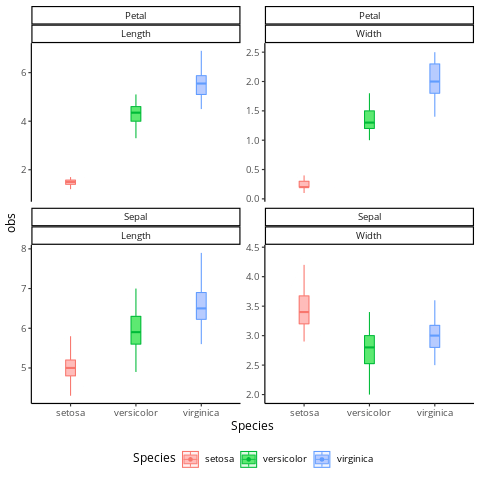

---
output:
  xaringan::moon_reader:
    seal: false
    css: [default,rutgers,metropolis-fonts,custom.css]
    lib_dir: libs
    fig_caption: yes
    fig_height: 8
    fig_width: 10
    nature:
      highlightStyle: github
      highlightLines: true
      highlightSpans: true
      countIncrementalSlides: false
      ratio: '16:9'
---

```{r setup, include=FALSE}
require(knitr)
require(kableExtra)
require(tidyverse)
options(kableExtra.latex.load_packages = FALSE)
options(knitr.table.format = "html")
knitr::opts_chunk$set(dev = 'svg') # set output device to svg
```

class: center, middle
background-image: url(imgs/LOGO-bigA-3101.jpg),url(imgs/cbi.png),url(imgs/logo_UT3_RVB.png)
background-position: 100% 0%,25% 100%,75% 100%
background-size: 28%,15%,20%

## .center[__Awesome visualisation with `R`__]

### .center[A journey with `ggplot2` and the `tidyverse`]

<hr />

.large[Vincent ROCHER | bigA | 03/02/2022]


---

## Data analysis pipeline

```{r,echo=F,warning=F,message=F,fig.align='center',fig.height=3,fig.width=10}
require(ggbump)
data_progression <- tibble(
  Parts = c("Read data","Manipulate Data","Plot data","Customize<br>your plots"),
  Tools = c("readr","dplyr/tidyr","ggplot2","ggplot2<br>extensions")
) %>% mutate(order = 1:dplyr::n(),rank = rep(1,dplyr::n()))

data_begin_end <- tibble(
  x=c(0.55,4.55),y=c(1,1),label = c("Data","Descriptive<br>statistics")
)

my_color <- "#2980b9"
p0.training <- data_progression %>% ggplot(aes(order,rank,label = order)) + geom_bump(smooth = 15, size = 2, alpha = 1,col=my_color) + geom_point(col=my_color,alpha=1,size=10) +
  geom_text(col="white", fontface = "bold",size=6) +
  coord_cartesian(clip = 'off') +
  ggtext::geom_richtext(aes(label = Tools),vjust=-1,color=my_color,size=5) +
  ggtext::geom_richtext(data=data_begin_end,aes(x=x,y=y,label = label),fontface = "bold",inherit.aes = F,size=5,fill = NA, label.color = NA,) +
  theme(
        legend.position = "none",
        panel.grid = element_blank(),
        plot.title = element_text(hjust = .5, color = "white"),
        plot.caption = element_text(hjust = 1, color = "white", size = 8),
        plot.subtitle = element_text(hjust = .5, color = "white", size = 10),
        axis.line = element_blank(),
        axis.ticks = element_blank(),
        axis.text.y = element_blank(),
        axis.title = element_blank(),
        axis.text.x = ggtext::element_markdown(face = 2, color = "black",size = 14),
        panel.background = element_rect(fill = "white"),
        plot.background = element_rect(fill = "white")) +
  scale_x_continuous(breaks = data_progression$order %>% unique() %>% sort(),
                     labels = data_progression %>% distinct(order, Parts) %>% arrange(order) %>% pull(Parts))

p1.training <- filter(data_progression,order==1) %>% ggplot(aes(order,rank,label = order)) +
  geom_bump(data= data_progression,smooth = 15, size = 2,col=my_color,alpha=0.4) +
  geom_point(col=my_color,alpha=1,size=10) +
  geom_text(col="white", fontface = "bold",size=6,alpha=1) +
  ggtext::geom_richtext(data=data_begin_end,aes(x=x,y=y,label = label),fontface = "bold",inherit.aes = F,size=5,fill = NA, label.color = NA,) +
  coord_cartesian(clip = 'off') +
  ggtext::geom_richtext(aes(label = Tools),vjust=-1,color=my_color,size=5,alpha=1) +
  
  theme(
        legend.position = "none",
        panel.grid = element_blank(),
        plot.title = element_text(hjust = .5, color = "white"),
        plot.caption = element_text(hjust = 1, color = "white", size = 8),
        plot.subtitle = element_text(hjust = .5, color = "white", size = 10),
        axis.line = element_blank(),
        axis.ticks = element_blank(),
        axis.text.y = element_blank(),
        axis.title = element_blank(),
        axis.text.x = ggtext::element_markdown(face = 2, color = "black",size = 14),
        panel.background = element_rect(fill = "white"),
        plot.background = element_rect(fill = "white")) +
  scale_x_continuous(breaks = data_progression$order %>% unique() %>% sort(),
                     labels = data_progression %>% distinct(order, Parts) %>% arrange(order) %>% pull(Parts))
p2.training <- filter(data_progression,order<=2) %>% ggplot(aes(order,rank,label = order)) +
  geom_bump(data= data_progression,smooth = 15, size = 2,col=my_color,alpha=0.4) +
  geom_bump(smooth = 15, size = 2,col=my_color,alpha=1) +
  geom_point(col=my_color,alpha=1,size=10) +
  geom_text(col="white", fontface = "bold",size=6,alpha=1) +
  ggtext::geom_richtext(data=data_begin_end,aes(x=x,y=y,label = label),fontface = "bold",inherit.aes = F,size=5,fill = NA, label.color = NA,) +
  coord_cartesian(clip = 'off') +
  ggtext::geom_richtext(aes(label = Tools),vjust=-1,color=my_color,size=5,alpha=1) +
  
  theme(
        legend.position = "none",
        panel.grid = element_blank(),
        plot.title = element_text(hjust = .5, color = "white"),
        plot.caption = element_text(hjust = 1, color = "white", size = 8),
        plot.subtitle = element_text(hjust = .5, color = "white", size = 10),
        axis.line = element_blank(),
        axis.ticks = element_blank(),
        axis.text.y = element_blank(),
        axis.title = element_blank(),
        axis.text.x = ggtext::element_markdown(face = 2, color = "black",size = 14),
        panel.background = element_rect(fill = "white"),
        plot.background = element_rect(fill = "white")) +
  scale_x_continuous(breaks = data_progression$order %>% unique() %>% sort(),
                     labels = data_progression %>% distinct(order, Parts) %>% arrange(order) %>% pull(Parts))

p3.training <- filter(data_progression,order<=3) %>% ggplot(aes(order,rank,label = order)) +
  geom_bump(data= data_progression,smooth = 15, size = 2,col=my_color,alpha=0.4) +
  geom_bump(smooth = 15, size = 2,col=my_color,alpha=1) +
  geom_point(col=my_color,alpha=1,size=10) +
  geom_text(col="white", fontface = "bold",size=6,alpha=1) +
  ggtext::geom_richtext(data=data_begin_end,aes(x=x,y=y,label = label),fontface = "bold",inherit.aes = F,size=5,fill = NA, label.color = NA,) +
  coord_cartesian(clip = 'off') +
  ggtext::geom_richtext(aes(label = Tools),vjust=-1,color=my_color,size=5,alpha=1) +
  
  theme(
        legend.position = "none",
        panel.grid = element_blank(),
        plot.title = element_text(hjust = .5, color = "white"),
        plot.caption = element_text(hjust = 1, color = "white", size = 8),
        plot.subtitle = element_text(hjust = .5, color = "white", size = 10),
        axis.line = element_blank(),
        axis.ticks = element_blank(),
        axis.text.y = element_blank(),
        axis.title = element_blank(),
        axis.text.x = ggtext::element_markdown(face = 2, color = "black",size = 14),
        panel.background = element_rect(fill = "white"),
        plot.background = element_rect(fill = "white")) +
  scale_x_continuous(breaks = data_progression$order %>% unique() %>% sort(),
                     labels = data_progression %>% distinct(order, Parts) %>% arrange(order) %>% pull(Parts))

p4.training <- filter(data_progression,order<=4) %>% ggplot(aes(order,rank,label = order)) +
  geom_bump(data= data_progression,smooth = 15, size = 2,col=my_color,alpha=0.4) +
  geom_bump(smooth = 15, size = 2,col=my_color,alpha=1) +
  geom_point(col=my_color,alpha=1,size=10) +
  geom_text(col="white", fontface = "bold",size=6,alpha=1) +
  ggtext::geom_richtext(data=data_begin_end,aes(x=x,y=y,label = label),fontface = "bold",inherit.aes = F,size=5,fill = NA, label.color = NA,) +
  coord_cartesian(clip = 'off') +
  ggtext::geom_richtext(aes(label = Tools),vjust=-1,color=my_color,size=5,alpha=1) +
  
  theme(
        legend.position = "none",
        panel.grid = element_blank(),
        plot.title = element_text(hjust = .5, color = "white"),
        plot.caption = element_text(hjust = 1, color = "white", size = 8),
        plot.subtitle = element_text(hjust = .5, color = "white", size = 10),
        axis.line = element_blank(),
        axis.ticks = element_blank(),
        axis.text.y = element_blank(),
        axis.title = element_blank(),
        axis.text.x = ggtext::element_markdown(face = 2, color = "black",size = 14),
        panel.background = element_rect(fill = "white"),
        plot.background = element_rect(fill = "white")) +
  scale_x_continuous(breaks = data_progression$order %>% unique() %>% sort(),
                     labels = data_progression %>% distinct(order, Parts) %>% arrange(order) %>% pull(Parts))
print(p0.training)
```


---
class: center, middle
background-image: url(imgs/Tidyverse.png)
background-position: 0% 100%
background-size: 60%

.pull-right[

## R packages for data science

The tidyverse is an opinionated collection of R packages designed for data science. All packages share an underlying design philosophy, grammar, and data structures.

Install the complete tidyverse with:

```r
install.packages("tidyverse")
```

]

---

## Tidyverse


```{r eval=F}
require(tidyverse)
```

```
── Attaching packages ─────────────────────────────────────────── tidyverse 1.3.1 ──
✔ ggplot2 3.3.6     ✔ purrr   0.3.4
✔ tibble  3.1.7     ✔ dplyr   1.0.9
✔ tidyr   1.2.0     ✔ stringr 1.4.0
✔ readr   2.1.2     ✔ forcats 0.5.1
── Conflicts ────────────────────────────────────────────── tidyverse_conflicts() ──
✖ dplyr::filter() masks stats::filter()
✖ dplyr::lag()    masks stats::lag()
```

---

### Tidy data

> __Tidying:__ structuring datasets to facilitate analysis.

A tidy dataset :

```{r out.width = "100%", fig.align = "center",echo=F}
knitr::include_graphics("imgs/tidy-1.png")
```

---

### Why tidying a dataset ?

```{r define, echo=F, message=FALSE, warning=FALSE}
treatments <- 
    data.frame(
        treatment_a = sample(10:25,size = 3,replace = T),
        treatment_b = sample(10:25,size = 3,replace = T),
        treatment_c = sample(10:25,size = 3,replace = T)
    )
rownames(treatments) <- c("John Smith","Jane Doe","Mary Johnson")
```


```{r show1,results='asis',echo=F}
treatments %>% kable(caption = "Typical presentation dataset") %>%
  kable_styling(bootstrap_options = c("striped", "hover"))
```


```{r boxplot1, echo=T, fig.height=3.5, fig.width=8,fig.align='center'}
boxplot(treatments)
```

---

### Why tidying a dataset ?

```{r,echo=T}
treatments.2 <- t(treatments)
```


```{r, echo=F,results='asis'}
kable(treatments.2,caption = "The same data but structured differently") %>%
  kable_styling(bootstrap_options = c("striped", "hover"))
```


```{r boxplot2, echo=T, fig.height=3.5, fig.width=8,fig.align='center'}

boxplot(treatments.2)
```


---

### Why tidying a dataset ?

```{r}
treatments.3 <- tibble::rownames_to_column(treatments,var = "person")
treatments.3 <- tidyr::pivot_longer(treatments.3,-person,names_to = "treatment",values_to = "result")
```


```{r echo=FALSE, message=FALSE, warning=FALSE,results='asis'}
treatments.3 %>% mutate(treatment = cell_spec(treatment, align = "c",background =factor(treatment,unique(treatments.3$treatment),RColorBrewer::brewer.pal(length(unique(treatments.3$treatment)), "Spectral")))) %>% mutate(person = cell_spec(person, align = "c",background =factor(person,unique(treatments.3$person),RColorBrewer::brewer.pal(length(unique(treatments.3$treatment)), "Set1")))) %>% 
    mutate(result = cell_spec(result, align = "c",background ="black",color = "white")) %>% kable(caption = "An exemple of a tidy dataset",escape=F) %>%
  kable_styling(bootstrap_options = c("striped", "hover"))
```


---

### Why tidying a dataset ?

```{r boxplot3, echo=TRUE, fig.height=5, fig.width=8, message=FALSE, warning=FALSE,fig.align='center'}
boxplot(result~treatment,data=treatments.3)
```

---

### Why tidying a dataset ?

```{r boxplot4, echo=TRUE, fig.height=5, fig.width=8, message=FALSE, warning=FALSE,fig.align='center'}
boxplot(result~person,data=treatments.3)
```

---

### Why tidying a dataset ?

```{r boxplot5, echo=TRUE, fig.height=5, fig.width=8, message=FALSE, warning=FALSE,fig.align='center'}
boxplot(result~person+treatment,data=treatments.3)
```


---

## Read a dataset with base `R`

```{r}
read.table(file = "iris.tsv",sep="\t",header = T)
```

---

## Read a dataset with base `R`

* Return a `data.frame` object.
* `read.csv`, `read.csv2`, `read.delim` can also be used.
* Cannot read `.xsl` files (we have to use another package).

---

## Read a dataset with `readr`

```{r}
read_tsv(file = "iris.tsv")
```

---

## Read a dataset with `readr`

* Return a `tibble` object.
* `read_csv`, `read_csv2`, `read_table` can also be used.
* `.xsl` files are managed by `readxl`, an other tidyverse package (not loaded by default). 

---

###Tibbles: `tibble::tibble()`

__Pros: __

* Cells can contain list and data.frame.
* It never changes an input’s type (i.e., no more `stringsAsFactors = FALSE`!).
* Can use not valid R variable names (`:)`) as column names.
* Refined print method that shows only the first 10 rows.


__Cons: __

* It never uses `row.names()`.
    * use `tibble::rownames_to_column()`.
---

## Data manipulation with `dplyr` and `tidyr`

#### dplyr is a grammar of data manipulation, providing a consistent set of verbs that help you solve the most common data manipulation challenges:

* `mutate()` adds new variables that are functions of existing variables
* `select()` picks variables based on their names.
* `filter()` picks cases based on their values.
* `summarise()` reduces multiple values down to a single summary.
* `arrange()` changes the ordering of the rows.
* `group_by()` perform any operation "by group".

#### Some examples :

.pull-left[
```{r}
summarise(iris,mean(Petal.Width))
```
]
.pull-right[
```{r}
summarise(group_by(iris,Species),mean(Petal.Width))
```
]


---

##Pipes

__The pipe %>%:__

* Come from the \textbf{magrittr} package by Stefan Milton Bache.
* Automatically loaded in tidyverse.
* Equivalent to `|` in `bash`

```{bash echo=TRUE}
cat iris.tsv | cut -f5 | sed 's/^./\U&/' | head
```

```{r echo=TRUE, message=FALSE, warning=FALSE}
read_tsv("iris.tsv",col_names = F) %>% pull(5) %>% str_to_title() %>% head
```

---

##Pipes vs no pipes : without pipe

```{r,echo=FALSE}
set.seed(123)
```

```{r histo1,echo=T, fig.height=3, fig.width=8,fig.align='center'}
ex.dat <- rnorm(n = 1000,mean = 5,sd=1)
sub.dat <- sample(ex.dat,size = 100,replace=F)
hist(sub.dat)
```

---

##Pipes vs no pipes : without pipe

```{r,echo=FALSE}
set.seed(123)
```

```{r histo2,echo=T, fig.height=3, fig.width=8,fig.align='center'}
hist(sample(rnorm(n = 1000,mean = 5,sd=1),size = 100,replace=F))
```

---

##Pipes vs no pipes : with pipe

```{r,echo=FALSE}
set.seed(123)
```

```{r histo3,echo=T, fig.height=3, fig.width=8,fig.align='center'}
rnorm(n = 1000,mean = 5,sd=1) %>%
    sample(size = 100,replace=F) %>%
    hist()
```


---

## Data manipulation with `dplyr` and `%>%`

## Prepare `iris` dataset for `ggplot2`


```{r}
iris.tbl <- iris %>%
  as_tibble() %>% 
  pivot_longer(-Species,names_to = "Type",values_to = "obs") %>%
  separate(Type,into = c("Part","Metric"),se="\\.")
```

```{r,echo=F}
iris.tbl %>%  head %>% kable()
```

---

```{r,echo=F}
theme_set(theme_classic(base_size=14))
```


### The three key components of every ggplot2

* __data__: the dataset who's need to be plotted.
* __aesthetics__: aesthetics mapping between variables in the data (x,y,visuals properties, ...).
* __geoms__: one or more layers to render each observations.

.center[
```{r out.width = '100%',echo=F}
knitr::include_graphics("imgs/data-visualization_ggplot2.svg")
```

]


---

### The three key components of every ggplot2

.pull-left[


```{r,eval=F}
ggplot(`data = iris.tbl`,
       `aes(x=Part,y=obs)`) +
  `geom_boxplot()`
```


* __data__: `data = iris`.
* __aesthetics__: `aes(x=Part,y=obs)`.
* __geoms__: `geom_boxplot()`.

]
.pull-right[

```{r,echo=F,width=4,height=4}
ggplot(data = iris.tbl,aes(x=Part,y=obs)) +
  geom_boxplot()
```


]


---

### The three key components of every ggplot2

.pull-left[


```{r,eval=F}
ggplot(`data = iris.tbl`,
       `aes(x=Part,y=obs,color=Species)`) +
  `geom_boxplot()`
```


* __data__: `data = iris`.
* __aesthetics__: `aes(x=Part,y=obs,color=Species)`.
* __geoms__: `geom_boxplot()`.

]
.pull-right[

```{r,echo=F,width=4,height=4}
ggplot(data = iris.tbl,aes(x=Part,y=obs,color=Species)) +
  geom_boxplot()
```


]


---

### The three key components of every ggplot2

.pull-left[


```{r,eval=F}
ggplot(`data = iris.tbl`,
       `aes(x=Part,y=obs,color=Species)`) +
  `geom_boxplot()` +
  facet_wrap(~Metric,scales="free_y")
```


* __data__: `data = iris`.
* __aesthetics__: `aes(x=Part,y=obs,color=Species)`.
* __geoms__: `geom_boxplot()`.
* __facet function__: `facet_wrap(~Metric,scales="free_y")`.

__Facetting__: 

* `facet_grid(~variable)` : Display all possibility even if some plots are __empty__.
* `facet_wrap(~variable)` : Display only the plots having actual values.


]
.pull-right[

```{r,echo=F,width=4,height=4}
ggplot(data = iris.tbl,aes(x=Part,y=obs,color=Species)) +
  geom_boxplot() +
  facet_wrap(~Metric,scales="free_y")
```


]


---

### The three key components of every ggplot2


.pull-left[

### Combining multiples `geom_`


```{r,eval=F}
ggplot(`data = iris.tbl`,
       `aes(x=Part,y=obs,color=Species)`) +
  `geom_boxplot(width=0.15,outlier.shape=NA)` +
  `geom_violin(alpha=0.2)` +
  `geom_jitter(width=0.15)`+
  facet_wrap(Part~Metric,scales="free_y") +
```


* `geom_boxplot(width=0.15,outlier.shape=NA)`: display data as boxplot, without outliers.
* `geom_violin(alpha=0.2)`: display data density, on mirror (violin).
* `geom_jitter(width=0.15)`: display data as point, using some random variation to `x` (jitter).

]

.pull-right[
```{r out.width = '100%',echo=F}

```

]


---


```{r ggplot11,echo=F, fig.height=12, fig.width=22, message=FALSE, warning=FALSE}

p1 <- iris %>%# Data
    ggplot(aes(x=Species,y=Petal.Length)) +# aesthetics
    geom_violin(col = "#3c6382") + geom_boxplot(col = "#3c6382",width=0.1) + geom_jitter(col = "#3c6382") +  theme_minimal() + ggtitle("discrete x, continous y") + theme(plot.title = element_text(size = 20, face = "bold"))
p2 <- iris %>%# Data
    ggplot(aes(x=Petal.Width,y=Petal.Length,label = Species)) +# aesthetics
    geom_point(col = "#3c6382") +# Layer: points
    geom_smooth(method = "loess",col="#3c6382") + theme_minimal() + ggtitle("continous x, continous y")  + theme(plot.title = element_text(size = 20, face = "bold"))

p3 <- iris %>% select(Petal.Width,Species) %>% group_by(Species) %>% mutate(pos = 1:n()) %>% group_by(pos) %>% summarise(mean = mean(Petal.Width), sd = sd(Petal.Width)) %>% ggplot(aes(x=pos,y=mean)) + geom_line(col = "#3c6382") + geom_ribbon(aes(ymin = mean - sd, ymax = mean + sd),fill = "#3c6382",alpha=0.3) + theme_minimal() + ggtitle("continous x, continous y")  + theme(plot.title = element_text(size = 20, face = "bold"))

p4 <- iris %>% ggplot(aes(Petal.Length)) + geom_histogram(aes(y=..density..),fill = "#3c6382") + geom_density(aes(y=..density..))  + ggtitle("one variable continous")  + theme_minimal()+ theme(plot.title = element_text(size = 20, face = "bold"))

p5 <- iris %>%
    gather(key = "Type",value = "obs",-Species) %>% separate(Type,into = c("Type_1","Type_2"),se="\\.") %>% ggplot(aes(x=Type_1,y = obs)) + geom_bar(stat = "summary", fun.y = "mean",fill= "#3c6382",width=0.5) + facet_wrap(~Type_2,scale="free_y") + theme_minimal()  + ggtitle("discrete x, continous y") + theme(plot.title = element_text(size = 20, face = "bold"))

p6 <- iris %>% gather(key = "Type",value = "obs",-Species) %>% group_by(Species,Type) %>% mutate(individuals = 1:n()) %>% ggplot(aes(y=individuals,x=Type,fill=obs))+ geom_tile() + theme_minimal()  + ggtitle("discrete x, discrete y") + theme(plot.title = element_text(size = 20, face = "bold"),legend.position = "none") + scale_fill_gradient2(low = "#f5f6fa",high = "#3c6382")

cowplot::plot_grid(p1,p5,p6,p2,p3,p4)

```


